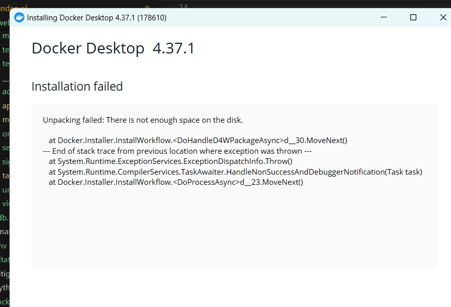

# What is this about?

there is a list of customers in the Site table. Each customer has a unique id and a name. Our servers are shared across all customers. Since resources are shared amongst all customers, we need to dynamically handle their asynchronous tasks. We need to create a system to handle the following tasks:

1. create a datastructure/store to store type of job based on their execution time. you can assume time in seconds and there are 5 types of jobs.
2. create a datastructure/store to store type of customer based on their record volume. large volume customers will tend to comsume more resources. you can assume there are 3 types of customers.
3. create relevant apis to support the interactions.
4. create workers which will pick up the job based on the customer type and job type and execute them. you can assume that each worker can execute only one job at a time.

refer website/models.py for Site Table <br>
refer website/tasks.py for the tasks to be executed

you can use any database, message queue, etc. to store the data. you can use any library to create the workers or any other part of the system. you can create any number of files, classes, functions, etc. to complete the assignment.

# Name and email

```
Somasree Majumder
seckroll16@gmail.com
```


# What will be evaluated?

1. Code quality
2. high level design
3. api design

# Drawbacks

I have included a Dockerfile and am familiar with Docker but recently due to some laptop issues I am not being able to install Docker , my Ubuntu is not starting at all. Actually machine was dual booted with very less space on windows and more space on Ubuntu, now Ubuntu is not starting  due to some issues ,since I have made software changes hence getting no help from this from where I have bought this.Thats why the Docker and the database connection is not fully working. I  <br>



Since the


